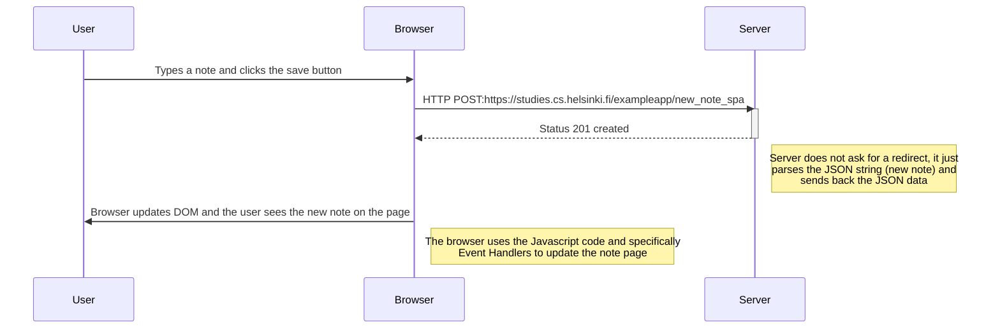

```mermaid
sequenceDiagram

    participant User
    participant Browser

    User->>Browser: Types a note and clicks the save button

    participant Server

    Browser->>Server: HTTP POST:https://studies.cs.helsinki.fi/exampleapp/new_note_spa
    activate Server
    Server-->>Browser: Status 201 created
    deactivate Server
    Note right of Server: Server does not ask for a redirect, it just<br/> parses the JSON string (new note) and <br/>sends back the JSON data
    
    Browser->>User: Browser updates DOM and the user sees the new note on the page
    Note right of Browser: The browser uses the Javascript code and specifically <br/>Event Handlers to update the note page
```