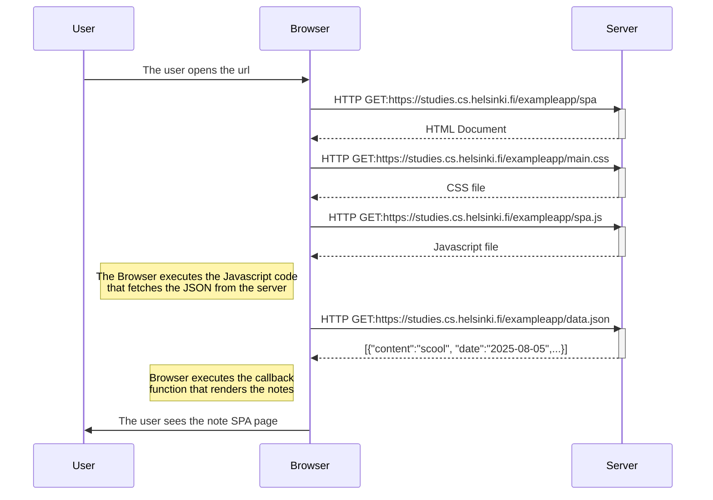

```mermaid

sequenceDiagram

        participant User
        participant Browser

        User->>Browser: The user opens the url

        participant Server

        Browser->>Server: HTTP GET:https://studies.cs.helsinki.fi/exampleapp/spa
        activate Server
        Server-->>Browser: HTML Document
        deactivate Server

        Browser->>Server: HTTP GET:https://studies.cs.helsinki.fi/exampleapp/main.css
        activate Server
        Server-->>Browser: CSS file
        deactivate Server

        Browser->>Server: HTTP GET:https://studies.cs.helsinki.fi/exampleapp/spa.js
        activate Server
        Server-->>Browser: Javascript file
        deactivate Server

        Note left of Browser: The Browser executes the Javascript code <br/> that fetches the JSON from the server

        Browser->>Server: HTTP GET:https://studies.cs.helsinki.fi/exampleapp/data.json
        activate Server
        Server-->>Browser: [{"content":"scool", "date":"2025-08-05",...}]
        deactivate Server
        
        Note left of Browser: Browser executes the callback <br/> function that renders the notes
        Browser->>User: The user sees the note SPA page 
```